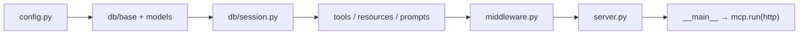

# Project Context: solomons-library
> Generated by verrueckt-cortex · 2026-04-09 · git:94caac0

## 1. Project Overview

Solomon's Library is a FastMCP server that provides embedding storage, semantic search, and book management over HTTP. It stores text embeddings (1536-dim vectors with HNSW cosine index) in PostgreSQL/pgvector and exposes tools, resources, and prompts via the MCP protocol. Embedding generation uses OpenAI as primary with Google Gemini as fallback, and background tasks run through a Redis-backed Docket queue.

**Type**: single-app (MCP server)
**Stack**: Python 3.13, FastMCP 3.2.2, SQLAlchemy 2.0+ async, Alembic, PostgreSQL + pgvector, Redis (Docket), OpenAI / Gemini, Loguru, httpx, uv

## 2. Architecture Flow

## 3. Key Paths

| Area | Path | Purpose |
|------|------|---------|
| Entry point | `src/solomons_library/server.py` | FastMCP instance, lifespan, tool/resource/prompt registration |
| Config | `src/solomons_library/config.py` | Frozen Settings dataclass loaded from env |
| Book model | `src/solomons_library/models/book.py` | Book ORM (id, title, author, isbn, created_at) |
| Embedding model | `src/solomons_library/models/embedding.py` | Embedding ORM with Vector(1536) and HNSW cosine index |
| DB session | `src/solomons_library/db/session.py` | Async engine + session factories (asyncpg / psycopg) |
| Embed tools | `src/solomons_library/tools/embed.py` | embed_text (Docket task), search_embeddings, OpenAI→Gemini fallback |
| Middleware | `src/solomons_library/middleware.py` | 7-layer stack: error, retry, rate-limit, cache, response-limit, timing, logging |

## 4. Available Plugins / Tools

- **tools/books.py** — add_book, list_books, get_book MCP tools
- **tools/embed.py** — embed_text (background task), search_embeddings, _generate_embedding with OpenAI→Gemini fallback
- **tools/openapi.py** — import_openapi_spec: ingest an OpenAPI spec into the library
- **resources/__init__.py** — library://stats, library://books, library://books/{id}, library://embeddings/recent
- **prompts/__init__.py** — analyze_book, search_query, summarize_collection MCP prompts
- **Alembic** — 6 migrations under alembic/; manage schema evolution for Book and Embedding tables
- **graphify** — knowledge graph at graphify-out/; read GRAPH_REPORT.md before answering architecture questions

## 5. Key References

| Document | Path | When to Use |
|----------|------|-------------|
| CLAUDE.md | `CLAUDE.md` | Always — project rules, stack, and dev commands |
| pyproject.toml | `pyproject.toml` | Dependency versions, project metadata, uv config |
| Alembic config | `alembic.ini` | Migration settings and DB URL override |
| Graph report | `graphify-out/GRAPH_REPORT.md` | Architecture questions — god nodes and community structure |

## 6. Environment

| Tool | Status | Detail |
|------|--------|--------|
| gh | installed | repo `FrancisVarga/solomons-library` · authenticated |
| rtk | installed | **MANDATORY** — prefix ALL Bash commands with `rtk` |

> **RTK Enforcement**: `rtk` is available. ALL Bash tool invocations MUST be prefixed with `rtk`. Example: `rtk git status`, `rtk uv run python -m solomons_library`. See global CLAUDE.md for full command reference.
